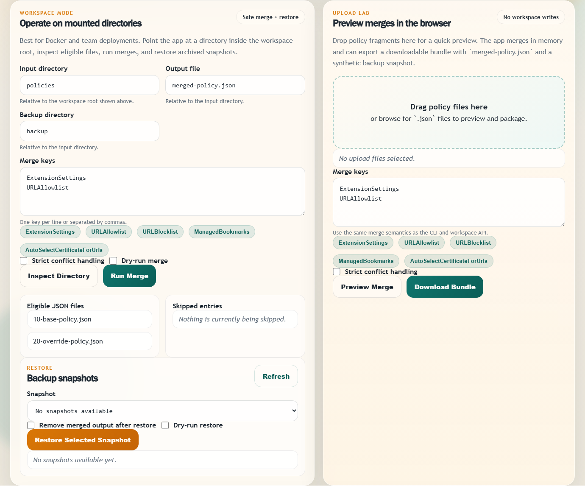
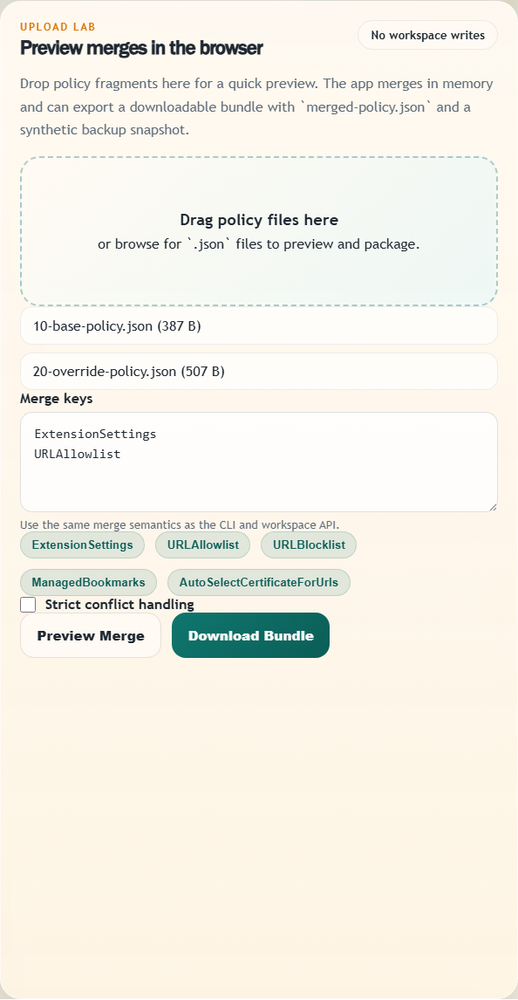
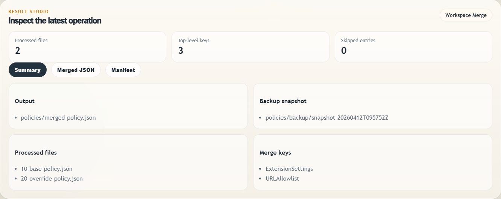

# Chrome Policy Merge

Chrome Policy Merge 4.0.1 is a web-first tool for safely merging Chrome enterprise policy JSON
fragments. It ships with a polished browser UI, a CLI, a Python API, and a Docker deployment
path so teams can run merges interactively or automate them in controlled environments.

## Overview

Chrome enterprise policy rollouts often involve multiple JSON fragments created by different
teams, packaging steps, or deployment pipelines. Chrome Policy Merge solves that problem with a
deterministic and safety-focused workflow:

- merges files in natural filename order
- validates every input before anything is moved
- writes merged output atomically
- archives source files into timestamped backup snapshots
- supports dry-run preview and safe restore workflows
- exposes the same merge engine through the web UI, CLI, and Python API

## What 4.0.1 Delivers

- A production-ready web console for upload previews and mounted workspace operations
- Docker support for quick self-hosted deployment
- A packaged CLI and library API for scripting and automation
- Explicit, documented merge semantics for replacements, deep dict merges, and ordered list unions
- Backup snapshots with `manifest.json` metadata and restore support
- Test, lint, type-check, and build automation for the full codebase

## Quick Start

### Web UI

Install the package and start the local web server:

```bash
python -m venv .venv
source .venv/bin/activate
python -m pip install .
chrome-policy-merge-web --host 127.0.0.1 --port 8000
```

On Windows PowerShell, activate the environment with `.venv\Scripts\Activate.ps1`.

Use a standard CPython 3.10+ interpreter for source installs. Some embedded vendor Python
distributions on Windows do not support source installs or isolated build hooks reliably. In
those environments, build the wheel first with `python -m build` and install from `dist/`.

Open [http://127.0.0.1:8000](http://127.0.0.1:8000).

By default, the web app uses a local `workspace/` directory as its workspace root. In the UI,
all workspace paths are relative to that root.

### Docker

Create a workspace directory on the host, place policy files inside it, then start the container:

```bash
mkdir -p workspace/policies
cp examples/input/*.json workspace/policies/
docker compose up --build
```

Open [http://localhost:8000](http://localhost:8000).

The supplied [`docker-compose.yml`](docker-compose.yml) mounts `./workspace` to `/workspace`
inside the container and sets `CHROME_POLICY_MERGE_WORKSPACE_ROOT=/workspace`.

## Web Console Workflows

### Workspace Mode

Workspace mode is intended for real operations on a mounted directory:

1. Set an input directory relative to the workspace root, such as `policies`.
2. Optionally change the output file and backup directory names.
3. Add merge keys such as `ExtensionSettings` or `URLAllowlist`.
4. Run a merge, dry-run, or restore a selected snapshot.

The UI shows:

- eligible JSON files
- skipped entries
- snapshot history
- merged JSON output
- manifest metadata from the latest merge or preview

### Upload Lab

Upload Lab is for quick browser-based previews:

- upload multiple `.json` files
- preview the merged output in memory
- download a bundle containing `merged-policy.json` and a synthetic backup snapshot

Upload previews do not mutate the workspace or create on-disk snapshots.

## Screenshots

Workspace operations on a mounted policy directory:



Browser-based upload preview and bundle export:



Merge result summary with output and snapshot details:



## CLI Usage

The CLI remains available for scripting and automation.

Top-level help:

```text
usage: chrome-policy-merge [-h] [--version] {merge,restore} ...
```

Merge command:

```text
usage: chrome-policy-merge merge [-h] [--merge-key KEY] [--output-file PATH]
                                 [--backup-dir PATH] [--dry-run] [--strict]
                                 [--verbose | --quiet]
                                 input_directory
```

Restore command:

```text
usage: chrome-policy-merge restore [-h] [--backup-dir PATH] [--snapshot NAME]
                                   [--output-file PATH] [--remove-output]
                                   [--dry-run] [--verbose | --quiet]
                                   input_directory
```

Web server command:

```text
usage: chrome-policy-merge-web [-h] [--host HOST] [--port PORT] [--reload]
```

Example merge:

```bash
chrome-policy-merge merge ./policies \
  --merge-key ExtensionSettings \
  --merge-key URLAllowlist \
  --output-file ./policies/merged-policy.json \
  --backup-dir ./policies/backup
```

Example restore:

```bash
chrome-policy-merge restore ./policies --backup-dir ./policies/backup --remove-output
```

## Python API

```python
from pathlib import Path

from chrome_policy_merge import MergeConfig, RestoreConfig
from chrome_policy_merge import merge_policy_directory, restore_backup_snapshot

merge_result = merge_policy_directory(
    MergeConfig(
        input_directory=Path("policies"),
        merge_keys=("ExtensionSettings", "URLAllowlist"),
    )
)

restore_result = restore_backup_snapshot(
    RestoreConfig(input_directory=Path("policies"))
)
```

## Merge Semantics

Files are merged in natural filename order, so `policy2.json` is processed before
`policy10.json`.

Default behavior for keys not listed in `--merge-key`:

- later files replace earlier values for the same top-level key
- with `--strict`, conflicting replacements become errors instead of silent overrides

Behavior for keys listed in `--merge-key`:

- `dict` + `dict`: recursively deep merged
- `list` + `list`: ordered union, preserving first-seen order
- scalar leaf values: later files replace earlier values
- incompatible container types: replaced by default, rejected with `--strict`

List uniqueness is based on JSON value equality.

## Backup and Restore Behavior

Each successful merge creates a timestamped snapshot directory inside the backup root. Every
snapshot includes:

- the original source JSON files
- a `manifest.json` file with merge metadata

Validation happens before files are moved. If an input is invalid, the run stops without writing
output or modifying the input directory.

Restore behavior:

- copies files back into the input directory
- refuses to overwrite existing policy files
- can optionally remove the merged output file
- accepts only snapshot directory names from the backup root

## API Endpoints

The web service exposes JSON APIs alongside the UI:

- `GET /api/health`
- `GET /api/config`
- `GET /api/workspace/scan`
- `GET /api/workspace/snapshots`
- `POST /api/workspace/merge`
- `POST /api/workspace/restore`
- `POST /api/upload/preview`
- `POST /api/upload/bundle`

Interactive API documentation is available at [http://localhost:8000/api/docs](http://localhost:8000/api/docs)
when the server is running.

## Examples

The repository includes sample input policies and expected merged output in [`examples`](examples).
They can be used with either the web UI or the CLI.

## Development

Install the development environment:

```bash
python -m pip install -e ".[dev]"
pre-commit install
```

On Windows PowerShell, activate the environment with `.venv\Scripts\Activate.ps1`.

Run the validation suite:

```bash
python -m ruff check .
python -m ruff format --check .
python -m mypy src
python -m pytest
python -m build
```

Run the web app locally during development:

```bash
chrome-policy-merge-web --reload
```

Repository source entry point:

```bash
python -m uvicorn --app-dir src chrome_policy_merge.web:app --reload
```

Install the built wheel locally and verify both interfaces:

```bash
python -m pip install --force-reinstall dist/chrome_policy_merge-4.0.1-py3-none-any.whl
python -m chrome_policy_merge --help
chrome-policy-merge-web --help
```

## Documentation

- Change history: [CHANGELOG.md](CHANGELOG.md)
- Contribution guide: [CONTRIBUTING.md](CONTRIBUTING.md)
- Security policy: [SECURITY.md](SECURITY.md)
- Deployment notes: [docs/deployment.md](docs/deployment.md)
- Migration guidance: [docs/migration-guide.md](docs/migration-guide.md)

## License

This project is released under the [MIT License](LICENSE).
