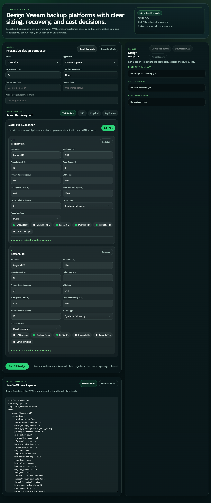
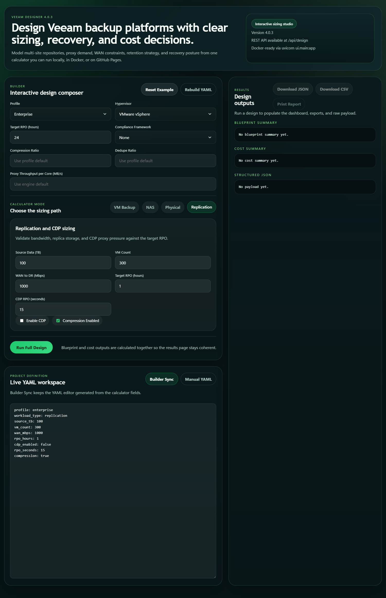
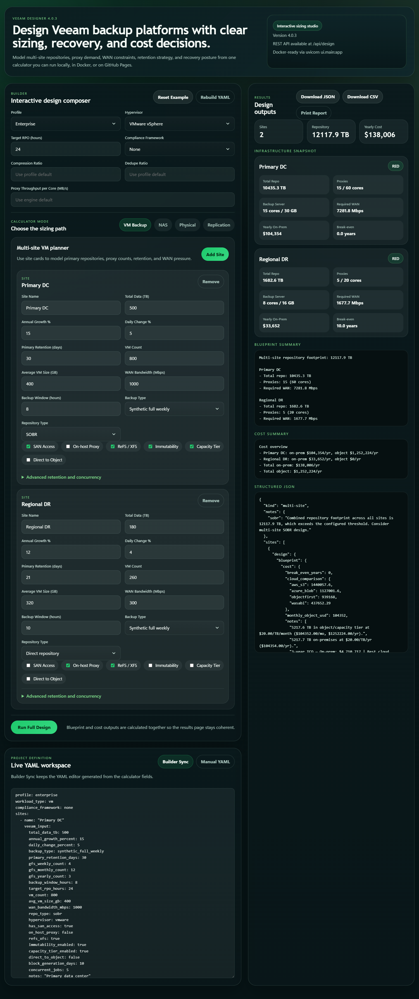

# Veeam Designer

Veeam Designer is a web-first sizing and architecture calculator for Veeam backup environments.
Release `4.0.3` sharpens the web UI, fixes the dark-theme form controls, and adds a real GitHub
Pages deployment path that runs the same sizing engine in the browser. It helps Veeam
administrators model repository footprint, proxy and backup server requirements, WAN feasibility,
replication pressure, NAS protection, licensing, tape, compliance, and high-level cost tradeoffs
from a guided UI, YAML project files, Docker, GitHub Pages, or the CLI.

## Why It Exists

Sizing Veeam environments by hand usually means stitching together retention math, proxy
throughput assumptions, WAN constraints, GFS policies, and object storage decisions across
multiple spreadsheets. Veeam Designer puts those planning paths into one calculator so teams can:

- estimate multi-site repository footprint with growth and GFS retention
- check proxy sizing, backup server demand, and WAN feasibility
- evaluate specialist calculators for NAS, physical agents, and replication / CDP
- export structured JSON, CSV, and printable HTML reports
- run the same engine in the browser, over REST, from the CLI, or in Docker

## Screenshots

VM planner with multi-site infrastructure inputs and live YAML:



Replication sizing workflow in the restored calculator UI:



Results dashboard after a design run:



## Quick Start

### Local Install

Create a virtual environment, install the package, and launch the web app:

```bash
python -m venv .venv
source .venv/bin/activate
python -m pip install .
veeam-designer-web --host 127.0.0.1 --port 8000
```

On Windows PowerShell, activate with:

```powershell
.venv\Scripts\Activate.ps1
```

Open [http://127.0.0.1:8000/run](http://127.0.0.1:8000/run).

If you are using an embedded vendor Python build on Windows and editable installs fail because of
build isolation restrictions, use a standard CPython installation instead. In constrained
environments, `python -m pip install --no-build-isolation -e .` is also a practical fallback.

### Docker

Build and run the web UI with Docker Compose:

```bash
docker compose up --build
```

Open [http://localhost:8000/run](http://localhost:8000/run).

The compose file mounts `config.json` and `profiles.json` read-only so local tuning changes are
picked up without rebuilding the image.

### GitHub Pages

The repository now includes a static Pages build that runs the sizing engine in the browser:

```bash
python -m build --wheel
python tools/build_pages.py --output _site
```

The published Pages URL is:

- [https://eblackrps.github.io/veeam_designer/](https://eblackrps.github.io/veeam_designer/)

The Pages edition keeps the calculator, YAML workflow, JSON export, CSV export, and print view in
the browser. The local FastAPI app remains the best fit when you want REST endpoints or server-side
report/export routes.

## Web UI

The default experience is the browser calculator at `/run`.

### Calculator Modes

- `VM Backup` for multi-site infrastructure planning with site cards, GFS retention, capacity tier,
  WAN, and proxy assumptions
- `NAS` for unstructured data sizing, file proxy estimation, and cache / repository demand
- `Physical` for agent-based workloads and coordinator sizing
- `Replication` for replica storage, WAN requirements, and CDP pressure

### Builder and YAML Workflow

The UI keeps a live YAML workspace next to the calculator:

- `Builder Sync` keeps YAML generated from the form
- `Manual YAML` lets you hand-edit the project definition directly
- `Rebuild YAML` replaces manual edits with the current calculator state

### Results

A completed design run produces:

- a headline summary with repo, proxy, and cost metrics
- per-site dashboard cards for VM designs
- operator-facing blueprint and cost summaries
- the full structured JSON payload used by the REST API
- CSV export for the last run
- a print-friendly report path in both the local app and the GitHub Pages edition

## CLI

The CLI stays available for automation and file-based workflows.

### Help

```bash
veeam-designer --help
veeam-designer-web --help
```

### Common Examples

Run a project file and print the human summary:

```bash
veeam-designer --project-file example-project.yml
```

Return machine-readable JSON:

```bash
veeam-designer --project-file example-project.yml --json
```

Launch the web app:

```bash
veeam-designer-web --reload
```

## REST API

The web service exposes a compact API alongside the UI:

- `GET /api/health`
- `GET /api/profiles`
- `POST /api/design`

Example:

```bash
curl -X POST http://127.0.0.1:8000/api/design \
  -H "Content-Type: text/plain" \
  --data-binary @example-project.yml
```

`POST /api/design` returns a versioned payload with a `kind` field such as `multi-site`, `vm`,
`nas`, `physical`, or `replication`.

## Project File Format

The included [example-project.yml](example-project.yml) is the fastest starting point.

Example multi-site VM project:

```yaml
profile: enterprise
workload_type: vm
compliance_framework: hipaa

sites:
  - name: Primary DC
    veeam_input:
      total_data_tb: 500
      annual_growth_percent: 15
      daily_change_percent: 5
      backup_type: synthetic_full_weekly
      primary_retention_days: 30
      gfs_weekly_count: 4
      gfs_monthly_count: 12
      gfs_yearly_count: 3
      backup_window_hours: 8
      target_rpo_hours: 4
      vm_count: 800
      avg_vm_size_gb: 400
      wan_bandwidth_mbps: 1000
      repo_type: sobr
      hypervisor: vmware
      has_san_access: true
      immutability_enabled: true
      capacity_tier_enabled: true
```

Specialist calculator examples:

```yaml
profile: enterprise
workload_type: nas
source_tb: 120
share_count: 80
file_count_millions: 1.5
retention_days: 30
```

```yaml
profile: enterprise
workload_type: replication
source_tb: 100
vm_count: 300
wan_mbps: 1000
rpo_hours: 1
cdp_enabled: true
```

## Python API

You can call the same normalized payload generator from Python:

```python
from pathlib import Path

from veeam_designer.service import design_payload_from_project_file

payload = design_payload_from_project_file(Path("example-project.yml"))
print(payload["kind"])
```

## Development

Install the development environment:

```bash
python -m pip install -e ".[dev]"
```

Run the validation suite:

```bash
python -m ruff check .
python -m ruff format --check .
python -m pytest -q
python -m build
python tools/build_pages.py --output _site
```

Run the web app from source:

```bash
veeam-designer-web --reload
```

or:

```bash
python -m uvicorn --app-dir . ui.main:app --reload
```

## Repository Layout

```text
veeam_designer/   core sizing engine and shared services
ui/               FastAPI app, templates, and static assets
tests/            pytest suite
config.json       tuning parameters
profiles.json     sizing profiles
example-project.yml
```

## Documentation

- [CHANGELOG.md](CHANGELOG.md)
- [CONTRIBUTING.md](CONTRIBUTING.md)
- [docs/deployment.md](docs/deployment.md)
- [SECURITY.md](SECURITY.md)

## License

Released under the [MIT License](LICENSE).
